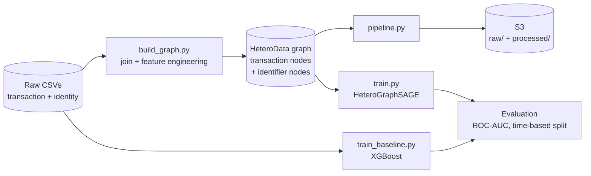

# Graph-Based Fraud Detection (IEEE-CIS)

Modeling the [IEEE-CIS Fraud Detection](https://www.kaggle.com/c/ieee-fraud-detection) dataset as a graph instead of a flat table: transactions that share a card, address, email domain, or device are linked together, and a GraphSAGE model is trained on top of that structure. Benchmarked directly against an XGBoost model trained on the same raw columns, using the same time-based train/validation split, to answer a specific question: **does relational structure add anything beyond what a strong tabular model already captures?**

## Architecture



## Graph construction

Nodes are **transactions**, plus one node type per identifier column (`card1`, `card2`, `addr1`, `P_emaildomain`, `DeviceInfo`, ...) — one node per distinct value seen in that column. A transaction connects to the identifier-value nodes it shares with other transactions (e.g. transaction 4021 → card1 node "9500").

Transactions are **never connected directly to each other** — every link routes through the shared identifier-value node instead. Connecting every pair of transactions that share a value would blow up combinatorially for a popular value (a common email domain shared by thousands of transactions); routing through a shared node keeps the graph sparse while preserving the same signal for a GNN's message passing to pick up.

One identifier was deliberately left out of the graph: `DeviceType` has only 2 distinct values, so as an edge it just creates two ~140k-degree hub nodes — mean-aggregating a transaction's neighborhood through "the mobile-device node" mostly averages in noise from an enormous, unrelated crowd. It's included as a direct transaction feature instead.

## Results

Same time-based validation split throughout (last 15% of transactions by `TransactionDT`, so validation is predicting forward in time rather than interpolating between transactions the model has already seen).

| Model | Val ROC-AUC | Notes |
|---|---|---|
| GraphSAGE v1 | 0.790 | 30 numeric features, 30 epochs |
| GraphSAGE v2 | 0.867 | + all 339 `V` columns, `DeviceType` moved to a feature, 100 epochs |
| **GraphSAGE v3** | **0.871** | + dropout, hidden_dim=128, early stopping on val AUC |
| **XGBoost baseline** | **0.903** | all 431 raw columns, label-encoded categoricals |

**Takeaways:**
- The single biggest lever was **feature parity** (v1→v2, +0.077): the first version of the graph model only saw 30 of the dataset's 431 columns. Graph structure can't make up for missing information the tabular model has direct access to.
- The `DeviceType` hub-node fix was folded into that same jump — a low-cardinality identifier column is a liability as a graph edge, not an asset.
- Architecture tuning (v2→v3: dropout, wider hidden layer, early stopping) closed the gap further, but with diminishing returns (+0.004) — full-batch training only allows one gradient step per epoch, which caps how much a deeper/wider network can be pushed without moving to mini-batch training.
- XGBoost still wins by ~0.03 AUC. That's not a failure of the graph approach — it's evidence that for this dataset, most of the fraud signal already lives in the engineered/anonymized `V` columns, and a graph model has to work harder (via message passing) to reconstruct relational signal that a tree model gets for free from raw column co-occurrence. Closing the remaining gap would mean mini-batch neighbor sampling and a deeper architecture search, not another quick fix.

## AWS usage

S3 stores the processed graph artifacts (`s3://<bucket>/processed/{train,test}_graph.pt`); raw CSVs can optionally be pushed to `raw/` via `--upload-raw`. Training itself runs locally — the dataset (~1.3GB) comfortably fits on a laptop, so there's no technical case for Glue/EMR/Spark-scale infrastructure here. SageMaker training/hosting would be the natural next AWS step if local compute became a bottleneck; it wasn't needed for this scope.

## Repo structure

```
src/
  build_graph.py     # raw CSVs -> HeteroData graph (nodes, edges, features)
  pipeline.py         # build_graph + upload processed artifacts to S3
  train.py            # HeteroGraphSAGE training, time-based split, early stopping
  train_baseline.py   # XGBoost baseline on the same split, for comparison
tests/
  test_build_graph.py # structural checks + a fraud/card1-clustering sanity check
data/processed/        # local graph artifacts (gitignored)
models/                 # trained checkpoints (gitignored)
```

## Running it

```
conda activate fraud-graph   # python 3.11, see requirements.txt
pip install -r requirements.txt

python src/build_graph.py --split train
python src/build_graph.py --split test
python -m pytest tests/ -v

python src/train.py                          # GraphSAGE, early stopping -> models/graphsage.pt
python src/train_baseline.py                 # XGBoost baseline

python src/pipeline.py --bucket <your-bucket>  # push processed artifacts to S3
```
